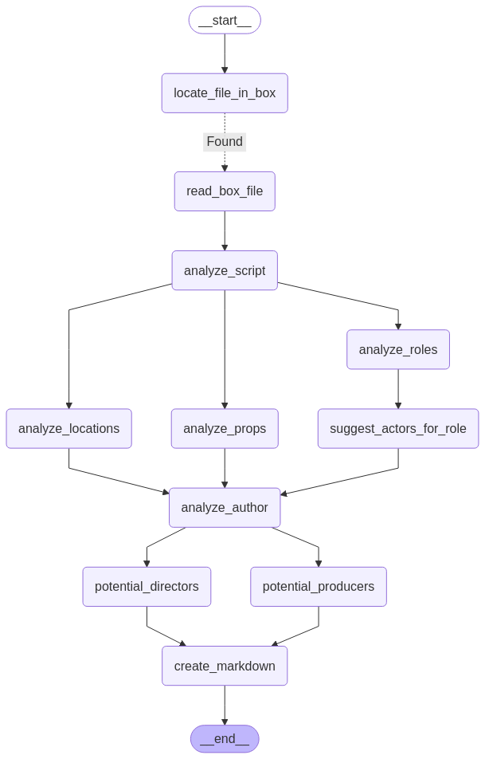

# LangGraph AI Workflow with Box API

This repository demonstrates how to build AI-powered workflows using LangGraph with Box API integration. The sample application processes movie scripts stored in Box, analyzes their content, and generates comprehensive reports with details about the script, locations, characters, props, author information, and suggestions for producers and directors.

## Prerequisites

- Python 3.13 or higher
- A Box developer account with access to Box API
- API credentials for Box configured in your environment
- An OpenAI API Key


## Getting Started

### 1. Clone the Repository

```bash
git clone https://github.com/your-username/langgraph-ai-workflow.git
cd langgraph-ai-workflow
```

### 2. Set Up Your Environment

Install the dependencies:

```bash
uv sync
```


### 3. Configure Box API Credentials

Create a `.env` file in the root directory with your Box API credentials:

```
LANGSMITH_TRACING = "true"
LANGSMITH_API_KEY = 

OPENAI_API_KEY = sk-

BOX_CLIENT_ID = ""
BOX_CLIENT_SECRET = ""
BOX_SUBJECT_TYPE = "user"
BOX_SUBJECT_ID = ""

```

### 4. Prepare Your Box Environment

1. Create a folder named "Scripts" in your Box account
2. Upload sample movie scripts from the `sample_data` folder to your Box "Scripts" folder

## Project Structure

```
langgraph-ai-workflow/
├── .python-version        # Python version specification
├── LICENSE                # MIT License
├── README.md              # This file
├── pyproject.toml         # Project dependencies
├── output/                # Generated output files
├── sample_data/           # Sample movie scripts for upload to Box
└── src/                   # Source code
    ├── box_agent_tools.py # Box API integration tools
    ├── console_utils.py   # Console output utilities
    ├── demo.py            # Main demo application
    ├── file_utils.py      # File handling utilities
    ├── workflow_classes.py # Data models for the workflow
    ├── workflow_design.py  # Workflow graph definition
    └── workflow_steps.py   # Individual workflow step implementations
```

## Understanding the Workflow

The workflow is designed using LangGraph's state-based graph architecture. Here's how the workflow operates:

1. **File Location**: Locates a movie script in your Box account
2. **File Reading**: Retrieves the content of the script
3. **Script Analysis**: Analyzes the script and extracts key information
4. **Parallel Processing**:
   - Extracts locations mentioned in the script
   - Identifies character roles in the script
   - Identifies props used in the script 
5. **Actor Suggestions**: Suggests modern actors for each character role
6. **Author Analysis**: Analyzes the script's author, their accomplishments and other works
7. **Suggestions**:
   - Recommends potential producers suitable for the script
   - Recommends directors whose style matches the script
8. **Report Generation**: Creates a comprehensive markdown report with all the gathered information

The workflow is defined in `workflow_design.py` and visualized with a Mermaid diagram saved to `output/workflow.png`.




## Running the Demo

To run the demo application:

```bash
uv run src/demo.py
```

By default, the application will:
1. Connect to your Box account
2. Look for "Hitchhiker's Guide to the Galaxy" script in your "Scripts" folder
3. Process the script through the workflow
4. Generate a markdown report in the `output` directory

## Customizing the Workflow

You can modify the demo to analyze different scripts by editing the `main()` function in `src/demo.py`:

```python
state = WorkFlowState(
    box_script_file=BoxFileLocation(
        file_name="Your-Script-Name",  # Change this to your script's filename
        parent_folder_name="Scripts",  # Change if your folder has a different name
    )
)
```

## Extending the Workflow

The modular design allows you to easily extend the workflow:

1. Add new data models in `workflow_classes.py`
2. Create new processing steps in `workflow_steps.py`
3. Add your steps to the workflow graph in `workflow_design.py`

## Key Components

- **LangGraph**: Orchestrates the workflow and manages state transitions
- **Box AI Agents Toolkit**: Connects to Box and provides access to Box API functionality
- **Pydantic Models**: Define structured data models for each step of the workflow
- **GPT Integration**: Leverages GPT-4o for content analysis and generation

## License

This project is licensed under the MIT License - see the [LICENSE](LICENSE) file for details.